# Windows Server 2022: Install, Configure, and Deploy Windows Server Update Services (WSUS) on Microsoft Azure

---

## Project Summary

**What This Project Is**

I deployed a Windows Server 2022 virtual machine in Microsoft Azure and installed/configured Windows Server Update Services (WSUS) to centrally manage Microsoft updates. This project demonstrates how to set up an update server in the cloud, synchronize with Microsoft Update, approve updates for testing, and configure client computers to receive updates. This simulates what IT professionals do to control patching and save bandwidth in enterprise environments.

**Languages Used**
- PowerShell - Used for server configuration and cleanup scripts

**Environments Used**
- Microsoft Azure (Cloud Platform)
- Windows Server 2022 (WSUS Server)
- Windows 11 (Client Machines)
- Azure Virtual Network

**Technologies/Applications/Services Used**
- Microsoft Azure Virtual Machines
- Windows Server Update Services (WSUS)
- Internet Information Services (IIS)
- Windows Update Service
- Group Policy
- Azure Networking (Virtual Networks, Network Security Groups)
- PowerShell

---

## Demonstration

### Phase 1: Azure Environment Setup

**Step 1: Create Azure Free Account**
I signed up for an Azure free account at portal.azure.com. The free account includes $200 credit for the first 30 days and 12 months of free services.

**Step 2: Create Resource Group**
In the Azure portal, I created a new resource group named "WSUS-Lab-RG" to organize all resources for this project.

**Step 3: Create Virtual Network**
I created a virtual network with:
- Name: WSUS-VNet
- Address space: 10.0.0.0/16
- Subnet: Default (10.0.0.0/24)

**Step 4: Create Windows Server 2022 VM**

In the Azure portal, I created a virtual machine with these settings:
- Resource group: WSUS-Lab-RG
- Virtual machine name: WSUS-Server
- Image: Windows Server 2022 Datacenter
- Size: Standard_B2ats_v2 (2 vCPUs, 1 GB RAM) - Free tier eligible
- Administrator account: azureadmin / [password]
- Inbound ports: Allow RDP (3389)

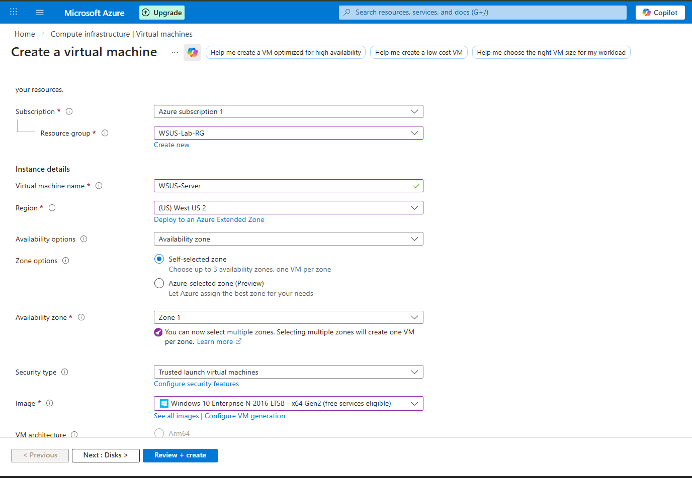
*Creating the Windows Server 2022 VM in Azure portal*

**Step 5: Configure Disk for Free Tier**
I ensured the OS disk was set to 64 GB to stay within free tier limits.

**Step 6: Review and Create**
Clicked "Review + create" and then "Create" to deploy the VM.

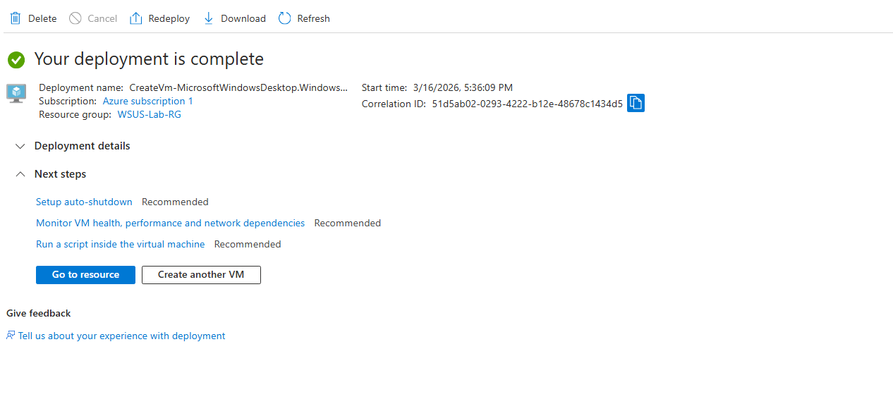
*VM deployment in progress and complete*

---

### Phase 2: Connect to Azure VM

**Step 7: Connect via RDP**

After deployment, I connected to the VM using Remote Desktop:
- Downloaded the RDP file from Azure portal
- Opened the file and clicked "Connect"
- Entered the administrator credentials

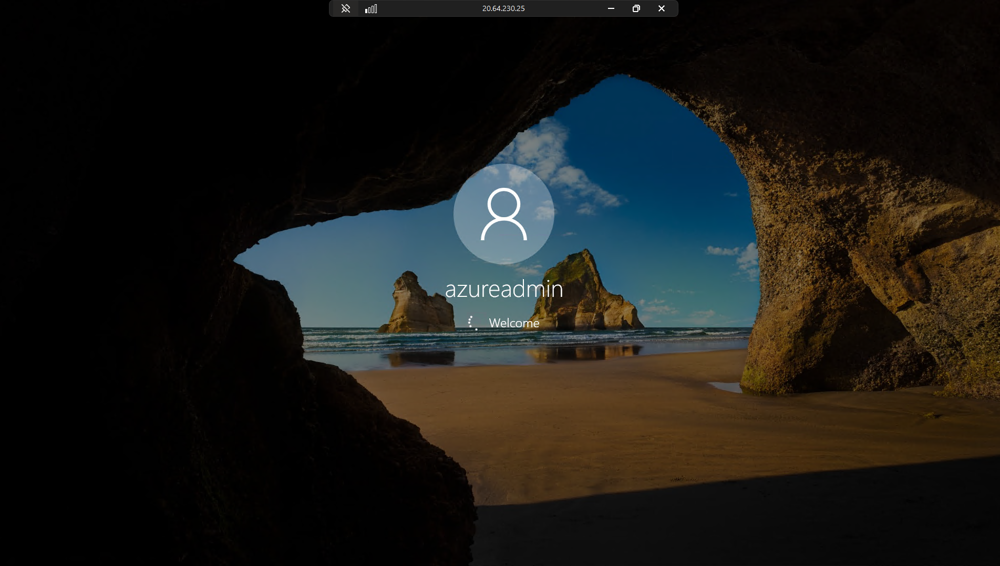
*Connecting to the Azure VM via Remote Desktop*

---

### Phase 3: WSUS Server Installation

**Step 8: Add WSUS Server Role**
In Server Manager, I clicked "Manage" → "Add Roles and Features" and selected "Windows Server Update Services".

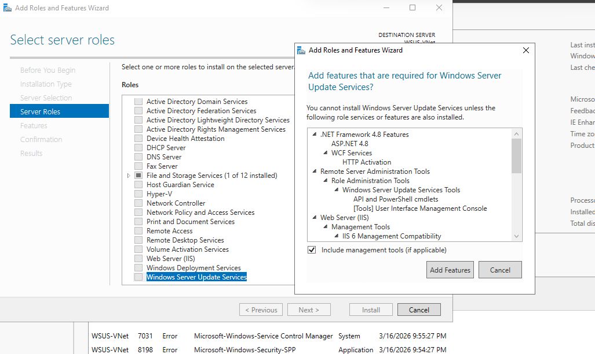
*Selecting WSUS role in Add Roles wizard*

**Step 9: Select Role Services**
I selected:
- WID Database (Windows Internal Database)
- WSUS Services

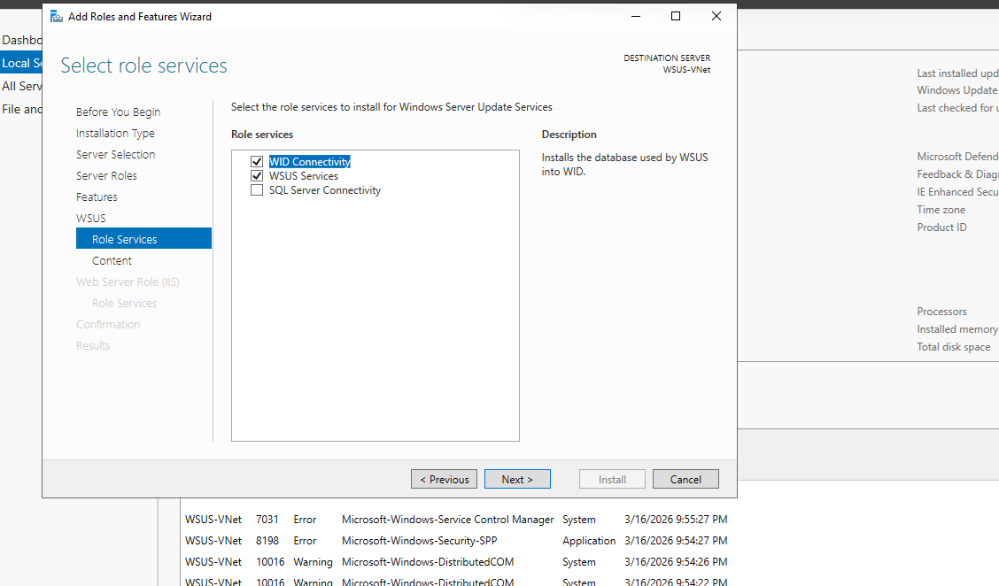
*Selecting WID Database and WSUS Services*

**Step 10: Complete Installation**
I completed the wizard and clicked "Install". The installation took about 10 minutes.

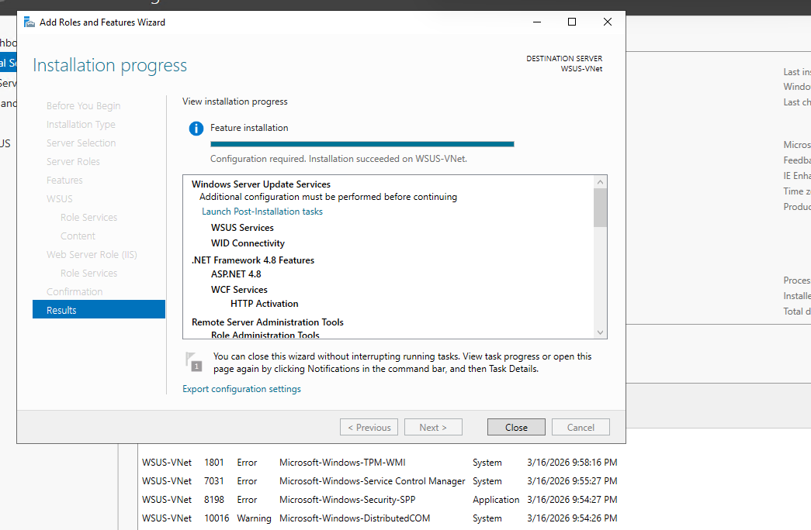
*WSUS role installation completed successfully*

---

### Phase 4: WSUS Configuration

**Step 11: Launch WSUS Configuration Wizard**
After installation, the WSUS configuration wizard opened automatically.

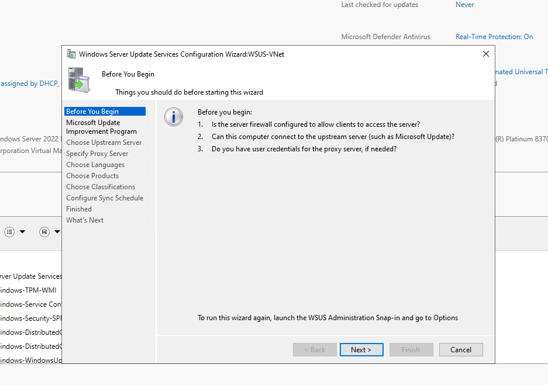
*WSUS configuration wizard after installation*

**Step 12: Choose Upstream Server**
I selected "Synchronize from Microsoft Update" to download updates directly from Microsoft.

**Step 13: Choose Languages**
I selected "English" only to save disk space and bandwidth.

**Step 14: Select Products**

I chose these products to sync:
- Windows 10 and later updates
- Windows Server 2022
- Microsoft 365 Apps
- .NET Framework

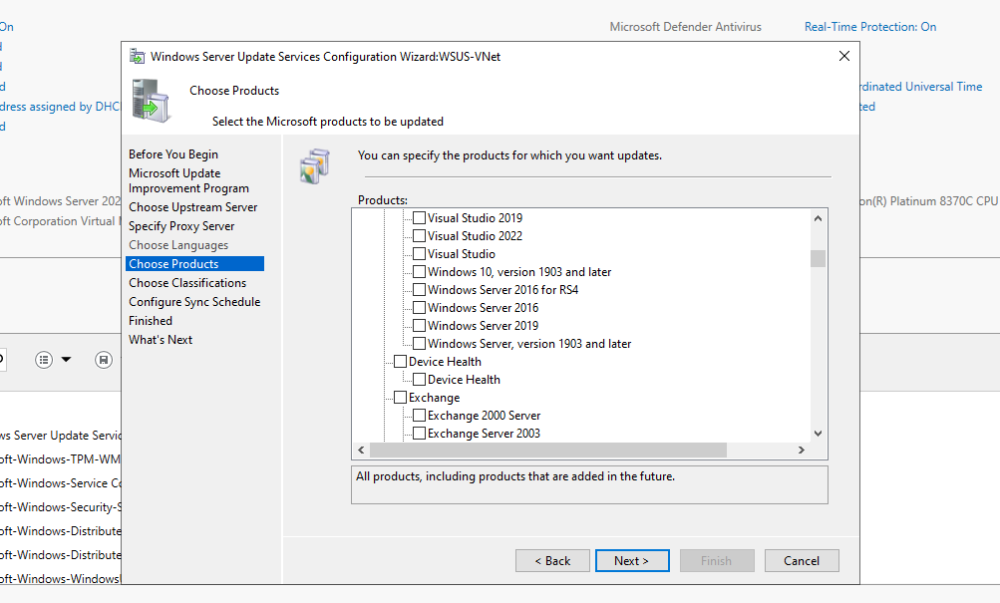
*Selecting which products to sync updates for*

**Step 15: Select Classifications**

I selected these update types:
- Critical Updates
- Security Updates
- Update Rollups
- Service Packs

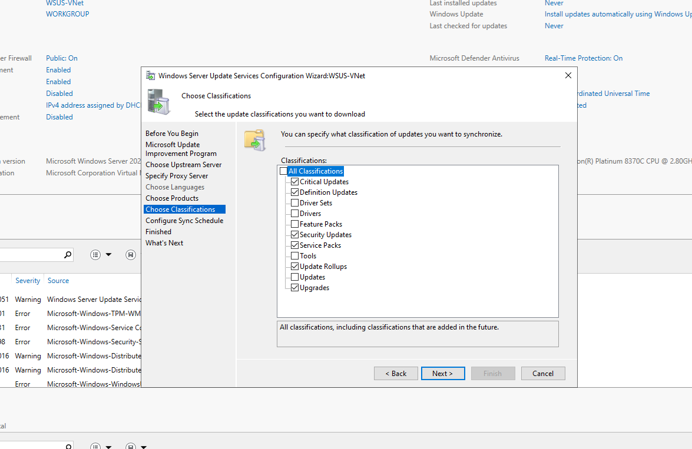
*Selecting update classifications to download*

**Step 16: Begin Initial Synchronization**
I clicked "Begin initial synchronization" and waited for updates to download. This took approximately 45 minutes.

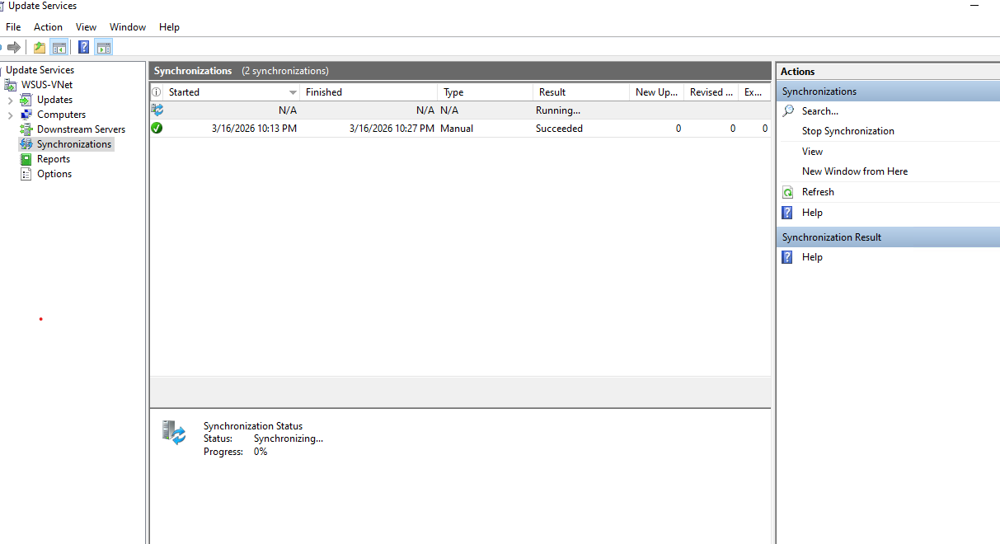
*Initial synchronization in progress*

---

### Phase 5: Post-Sync Configuration

**Step 17: Review Downloaded Updates**
After sync completed, I opened the WSUS console and saw over 1,200 updates available.

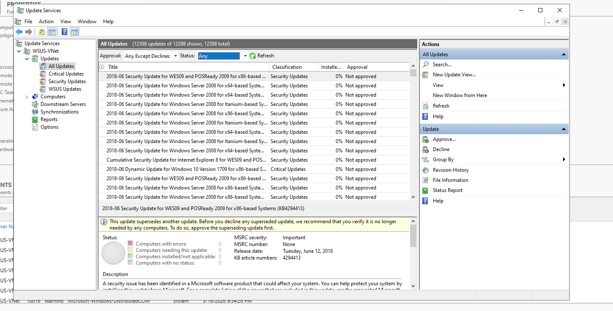
*WSUS console showing downloaded updates*

**Step 18: Create Computer Groups**

I created target groups for different deployment rings:
- TEST - For testing updates first
- WORKSTATIONS - For general employee computers
- SERVERS - For server systems

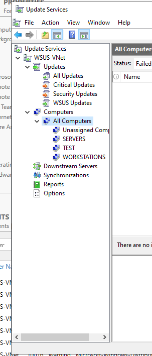
*Creating computer groups in WSUS*

---

### Phase 6: Azure Networking for WSUS

**Step 19: Open WSUS Port in Azure Firewall**

For clients to connect to WSUS, I opened port 8530 in Azure:
- Went to VM → Networking
- Added inbound port rule
- Destination port: 8530
- Protocol: TCP
- Name: Allow-WSUS

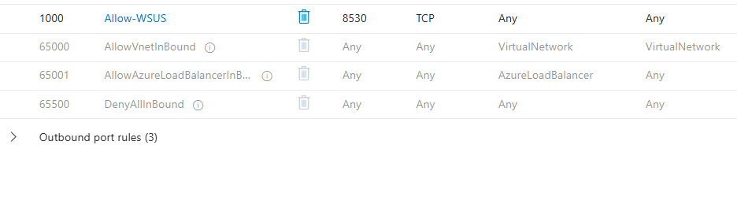
*Adding inbound rule for WSUS port 8530 in Azure*

---

### Phase 7: Group Policy Configuration

**Step 20: Create WSUS Group Policy Object**
I opened Group Policy Management Console and created a new GPO named "WSUS-Client-Settings".

**Step 21: Configure WSUS Server Settings**

I configured these settings:
- Specify intranet Microsoft update service location: http://[WSUS-Server-IP]:8530
- Configure Automatic Updates: Enabled
- Set schedule: Install every Sunday at 3:00 AM

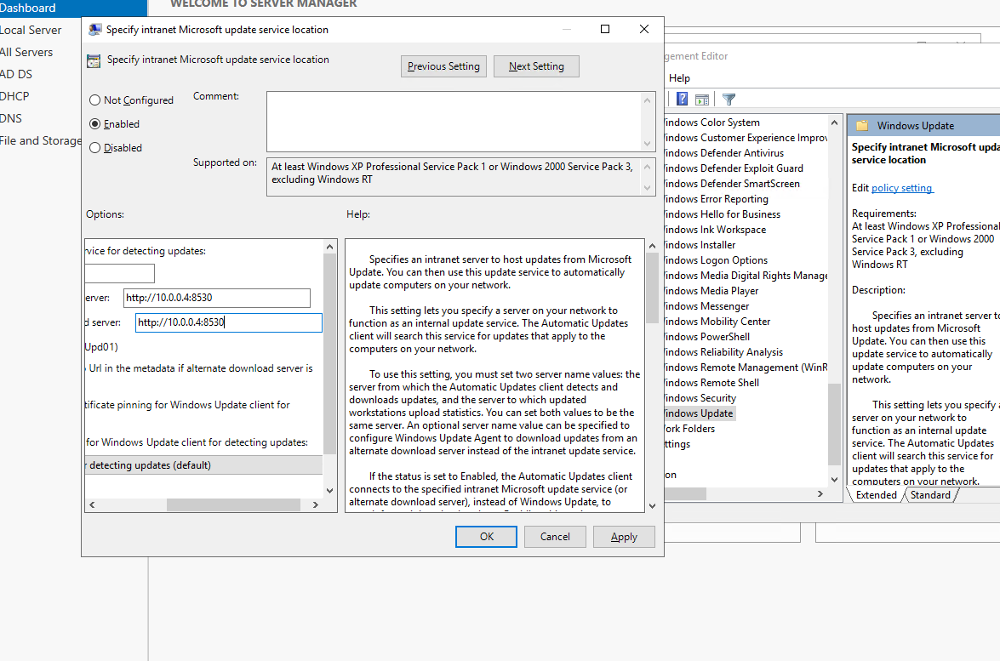
*Configuring WSUS settings in Group Policy*

---

### Phase 8: Client Testing

**Step 22: Force Group Policy Update on Client**
On a Windows 10 client, I ran:
gpupdate /force

**Step 23: Verify Client Registry Settings**
I opened Registry Editor and navigated to:
`HKEY_LOCAL_MACHINE\SOFTWARE\Policies\Microsoft\Windows\WindowsUpdate`

The registry showed:
- `WUServer` = http://10.0.0.4:8530 (my WSUS server IP)
- `WUStatusServer` = http://10.0.0.4:8530
- Under the `AU` subkey, `UseWUServer` = 1

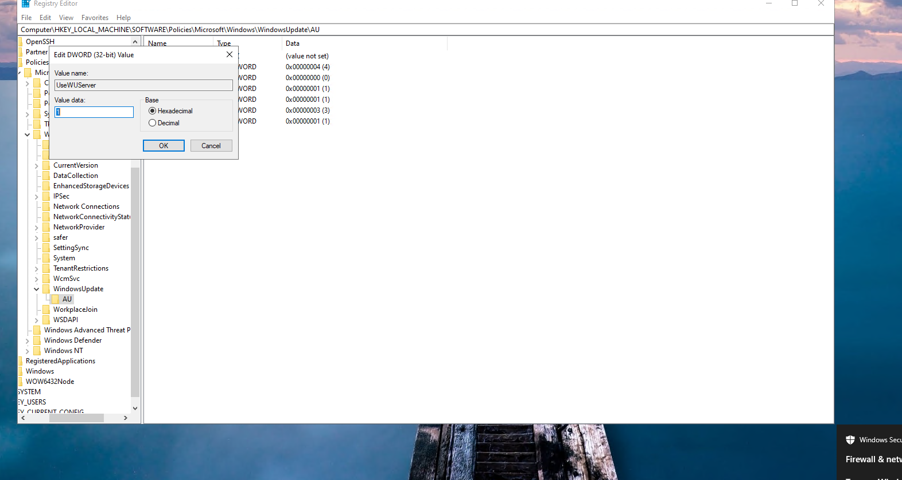
*Registry showing WSUS settings applied via GPO*

**Step 24: Force Client to Check for Updates**
I ran the following command to force the client to contact the WSUS server:
wuauclt /detectnow

**Step 25: Verify Client Appears in WSUS Console**
Back on the WSUS server, I opened the WSUS console and navigated to Computers → All Computers. After a few minutes, my Windows 10 client appeared in the list.

*Client computer showing up in WSUS console*

**Step 26: Move Client to TEST Group**
I right-clicked the client computer in WSUS console and selected "Change Membership". I checked the "TEST" group and clicked OK.

**Step 27: Check for Available Updates on Client**
Back on the Windows 10 client, I opened:
Settings → Update & Security → Windows Update
I clicked "Check for updates" and saw that updates were being detected from the WSUS server.

*Client detecting updates from WSUS server*

**Step 28: Approve Updates for TEST Group**
In the WSUS console, I:
1. Clicked "Updates" → "All Updates"
2. Filtered by "Approval: Unapproved" and "Status: Needed by clients"
3. Selected several critical and security updates
4. Right-clicked and chose "Approve"
5. Selected the "TEST" group and chose "Install" with deadline of 1 day

**Step 29: Install Updates on Client**
Back on the Windows 10 client, I clicked "Install now" in Windows Update. The updates downloaded from the WSUS server and installed successfully.

**Step 30: Verify Installation Success**
After restarting, I checked:
- Windows Update history showed the updates as successfully installed
- WSUS console showed the client had installed the updates
- The client reported its status back to WSUS

---

### Phase 9: Verification Testing

**Test 1: WSUS Server Connectivity**
Test-NetConnection [WSUS-Server-IP] -Port 8530

Result: ✅ PASSED - Client can connect to WSUS server on port 8530

**Test 2: Update Detection**
Client detects available updates from WSUS - ✅ PASSED

**Test 3: Update Installation**
Updates install successfully on client - ✅ PASSED

**Test 4: Group Policy Application**
WSUS settings correctly applied via GPO - ✅ PASSED

**Test 5: Reporting**
WSUS console shows client status and installed updates - ✅ PASSED

---

### Final Status

| Component | Status |
|-----------|--------|
| Azure VM Deployment | ✅ Complete |
| WSUS Server Installation | ✅ Complete |
| Initial Synchronization | ✅ Downloaded 1,200+ updates |
| Computer Groups | ✅ Created |
| Azure Networking (Port 8530) | ✅ Configured |
| Group Policy Configuration | ✅ Applied to clients |
| Client Detection | ✅ Working |
| Update Installation | ✅ Successful |
| WSUS Reporting | ✅ Working |

---

## What I Learned

- How to deploy Windows Server VMs in Microsoft Azure
- How to configure Azure networking for specific services
- How WSUS centralizes update management for an organization
- How Group Policy directs clients to the WSUS server
- The importance of testing updates before wide deployment
- How to save bandwidth by downloading updates once to the server
- How to verify client-server communication for updates
- How to approve and deploy updates in phases
